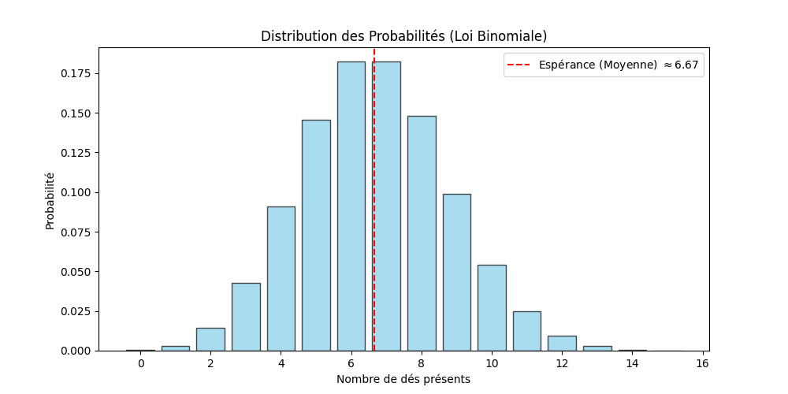
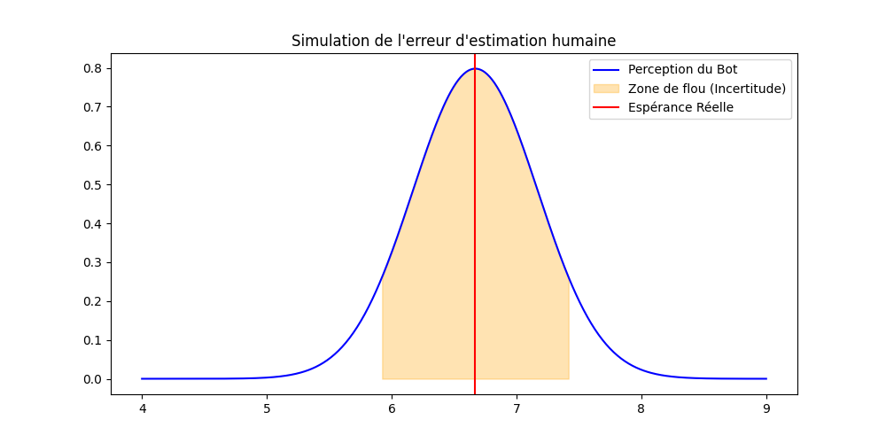
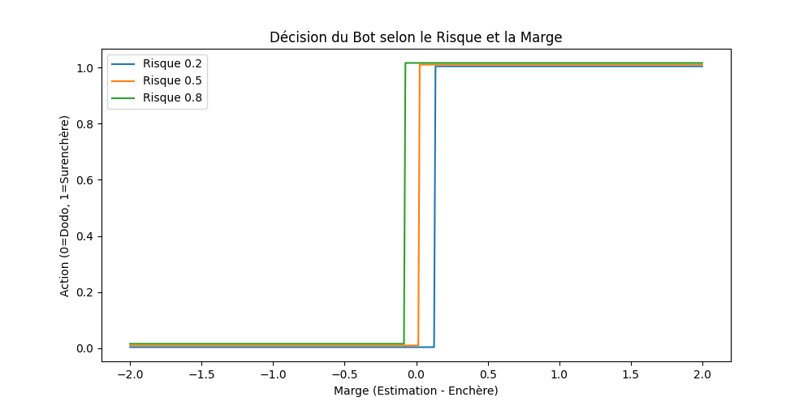

# Perudo AI – Reinforcement Learning Project
M1 Advanced Python – ISEN
January 2026

---

Marie Epinat - Antoine Tourneux - Hugo Betton - Elwen Coroller

---

## 1. Project Overview

This project implements the game **Perudo (Liar’s Dice)** using an object-oriented architecture in Python.

It includes:

- A complete game engine
- A probabilistic rule-based Bot
- A Reinforcement Learning AI
- Statistical modelling
- Performance visualisation
- Modular and maintainable code structure

The objective is to model strategic decision-making under uncertainty and evaluate how reinforcement learning improves performance over time.

---

## 2. Project Architecture

```
PerudoAI/
│
├── main.py                  # Launch the game
├── train_ai.py              # Train the reinforcement learning AI
│
├── game/                    # Core game logic
│   ├── game_engine.py
│   ├── player.py
│   ├── bot.py
│   ├── ai_player.py
│   └── rules.py
│
├── ai/                      # Reinforcement learning modules
│   ├── reinforcement.py
│   └── state_representation.py
│
├── visuals/                 # Generated graphs
│   ├── distribution_binomiale.png
│   ├── marge_erreur.png
│   ├── impact_risque.png
│   └── Figure_1.png
│
├── requirements.txt
└── README.md
```

The `main` branch is always functional and stable.

---

## 3. Installation Guide

### 3.1 Create a Virtual Environment

Using venv:

```bash
python -m venv venv
venv\Scripts\activate        # Windows
source venv/bin/activate       # Mac/Linux
```

Using conda:

```bash
conda create -n perudo python=3.10
conda activate perudo
```

### 3.2 Install Dependencies

```bash
pip install -r requirements.txt
```

### 3.3 Test Installation

```bash
python train_ai.py
```

If the performance graph appears without errors, installation is successful.

---

## 4. How to Use

### Step 1 – Train the AI

```bash
python train_ai.py
```

This will:
- Train the reinforcement learning agent
- Display the performance graph
- Save performance visualisations

### Step 2 – Launch the Game

```bash
python main.py
```

You can then:
- Play against the probabilistic Bot
- Observe AI behaviour
- Adjust risk parameters (if implemented)

---

## 5. Core Functionalities

### 5.1 Game Engine

- Dice generation and management
- Turn-based mechanics
- Validation of bets
- Dodo rule
- Tout Pile rule
- Player elimination
- Game termination logic

All game logic is separated from AI logic to ensure modularity.

---

### 5.2 Probabilistic Bot

The Bot estimates unknown dice quantities using the Binomial distribution:

P(X = k) = C(n, k) p^k (1 - p)^(n - k)

Where:
- n = number of unknown dice
- p = 1/3 (specific face + wild ones)

#### Dice Distribution



The red dashed line represents the expected value.

---

#### Human Estimation Error Simulation

To simulate imperfect perception, a Gaussian uncertainty model is introduced.



This creates realistic decision variability.

---

#### Risk Parameter Impact

The Bot's behaviour depends on a risk coefficient.



Higher risk values lead to more aggressive decisions.

---

### 5.3 Reinforcement Learning AI

The AI learns through repeated self-play.

#### State Representation

Includes:
- Current bet
- Dice counts
- Game progression
- Estimated opponent state

#### Reward System

- +1 → Win
- -1 → Loss
- Penalty → Illegal move

#### Exploration Strategy

- Epsilon-greedy policy
- Gradual exploration decay

---

## 6. Performance Analysis

Training produces the following performance graph:


This graph shows:

- 50-game moving average win rate
- Rapid improvement during early training
- Stabilisation over time
- Reduction of illegal moves

The AI progressively develops stable and consistent strategies.

---

## 7. Code Quality and Design

The project follows:

- Object-Oriented Programming principles
- Clear separation of concerns
- Modular file organisation
- English naming conventions
- PEP8 guidelines
- Reusable and extendable architecture

Each major component (Game, Bot, AI) is isolated to improve readability and maintainability.

---

## 8. Tested Environments

Successfully tested on:

- Windows 11 – Python 3.10
- macOS – Python 3.10
- Ubuntu 22.04 – Python 3.10

---

## 9. Conclusion

This project demonstrates:

- Strategic modelling under uncertainty
- Integration of probability theory
- Application of reinforcement learning
- Structured and maintainable Python development

It provides a complete example of combining statistical reasoning and machine learning within a game environment.

---

Academic Project – M1 ISEN – Advanced Python – 2026
